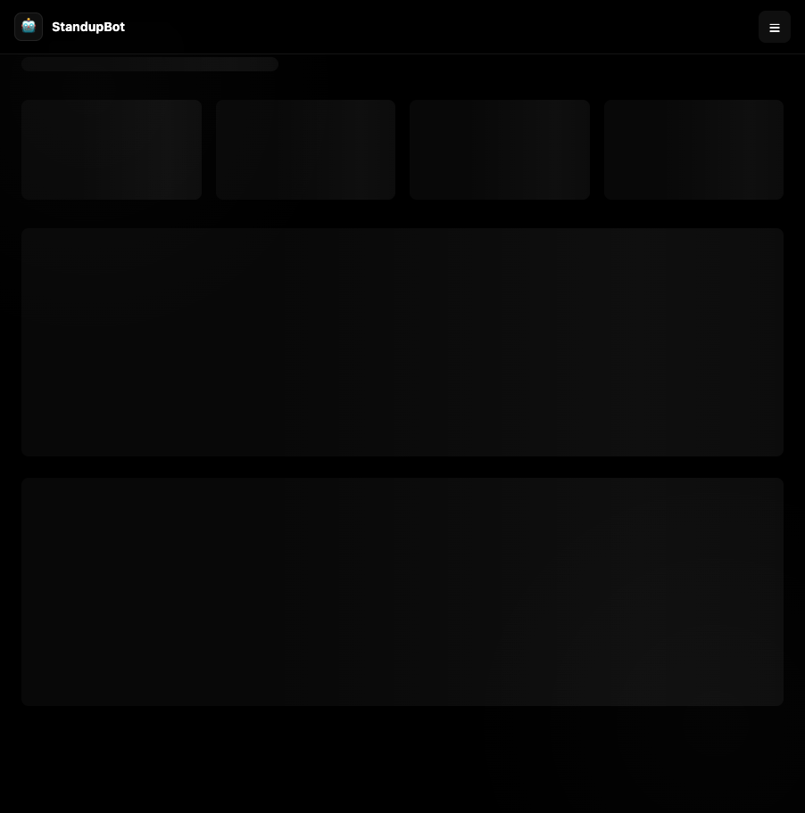

# StandupBot — AI-Powered Team Standup Dashboard

StandupBot replaces your daily standup meetings with a sleek web app. Team members submit quick daily check-ins, managers see everything on a real-time dashboard, and AI generates smart summaries highlighting blockers, patterns, and action items.

**[Live Demo](https://project-101-six.vercel.app)**



---

## What It Does

- **Daily Check-ins**: Team members answer 3 simple questions (yesterday, today, blockers) in 30 seconds
- **Live Dashboard**: See who submitted, who hasn't, and active blockers at a glance
- **Team Feed**: Browse all standup updates by date, filter by blockers
- **AI Summaries**: Generate daily or weekly AI-powered digests that highlight key progress, risks, and recommended actions
- **Team Management**: Add and remove team members from the admin panel
- **Blocker Alerts**: Blockers are highlighted with pulsing red badges — impossible to miss

---

## Tech Stack

| Layer | Technology | Why |
|-------|-----------|-----|
| **Framework** | Next.js 15 (App Router) | Full-stack React with API routes |
| **Language** | TypeScript | Type safety across the whole app |
| **Styling** | Tailwind CSS | Fast, utility-first dark theme |
| **AI** | Groq (Llama 3.3 70B) | Free, fast AI inference for summaries |
| **Storage** | JSON file store | Simple, no database setup needed |
| **Runtime** | Node.js | Server-side API routes |

---

## Project Structure

```
app/
├── app/                    # Next.js App Router pages
│   ├── page.tsx            # Dashboard — stats, team status, blockers
│   ├── submit/page.tsx     # Submit standup form
│   ├── feed/page.tsx       # Browse standups by date
│   ├── admin/page.tsx      # Team management + AI summaries
│   ├── layout.tsx          # Sidebar navigation layout
│   ├── globals.css         # Dark theme styles
│   └── api/
│       ├── standups/       # GET (list) / POST (submit) standups
│       ├── team/           # GET / POST / DELETE team members
│       └── summary/        # GET AI daily/weekly summary
├── lib/
│   ├── types.ts            # Shared TypeScript interfaces
│   ├── store.ts            # JSON file-based data persistence
│   └── ai.ts               # Groq AI summary generation
├── scripts/
│   └── seed.ts             # Seeds mock team + standup data
├── data/
│   └── store.json          # Data file (auto-created)
└── .env.local              # API keys (not committed)
```

---

## How to Run It

### Prerequisites
- **Node.js** 18 or higher
- A **Groq API key** (free at [console.groq.com](https://console.groq.com))

### 1. Install dependencies
```bash
cd app
npm install
```

### 2. Set up environment variables
Create a `.env.local` file in the `app/` directory:
```
GROQ_API_KEY=your_groq_api_key_here
```

### 3. Seed mock data (optional but recommended)
```bash
npm run seed
```
This creates 5 team members and 7 sample standups so you can see the app in action immediately.

### 4. Start the dev server
```bash
npm run dev
```

### 5. Open in your browser
Go to **http://localhost:3000**

---

## How to Use It

### As a Team Member
1. Go to the **Submit** page
2. Select your name
3. Answer the 3 questions (yesterday, today, blockers)
4. Click **Submit Standup** — done in 30 seconds

### As a Manager / Team Lead
1. **Dashboard** — Quick overview of who submitted, submission rate, and active blockers
2. **Feed** — Browse all updates by date, filter to see only blockers
3. **Admin** — Add/remove team members, generate AI summaries

### AI Summaries
1. Go to the **Admin** page
2. Choose **Daily Summary** or **Weekly Digest**
3. Pick a date and click **Generate**
4. AI reads all standups and generates insights: highlights, blockers, patterns, and action items

---

## API Endpoints

| Method | Endpoint | Description |
|--------|----------|-------------|
| `GET` | `/api/team` | List all team members |
| `POST` | `/api/team` | Add a team member `{ name, role }` |
| `DELETE` | `/api/team?id=xxx` | Remove a team member |
| `GET` | `/api/standups?date=YYYY-MM-DD` | Get standups (optional date filter) |
| `POST` | `/api/standups` | Submit a standup `{ memberId, yesterday, today, blockers }` |
| `GET` | `/api/summary?date=YYYY-MM-DD` | Generate AI daily summary |
| `GET` | `/api/summary?week=YYYY-MM-DD` | Generate AI weekly digest (pass a Monday) |

---

## Pages

| Page | URL | Purpose |
|------|-----|---------|
| Dashboard | `/` | Stats overview, team status, blocker alerts |
| Submit | `/submit` | Quick standup submission form |
| Feed | `/feed` | Browse all standup updates by date |
| Admin | `/admin` | Manage team + generate AI summaries |

---

## Notes

- **Storage**: Data is stored in `data/store.json`. For production/Vercel deployment, you'd want to migrate to a database like Upstash Redis or Supabase.
- **AI**: The Groq API is free and uses Llama 3.3 70B for generating summaries. Daily summaries are cached to avoid repeated API calls.
- **No auth**: This is a demo/internal tool — there's no login system. For production, add authentication (e.g., Clerk, NextAuth).
- **Re-submission**: If someone submits twice in one day, it replaces their previous entry (no duplicates).
